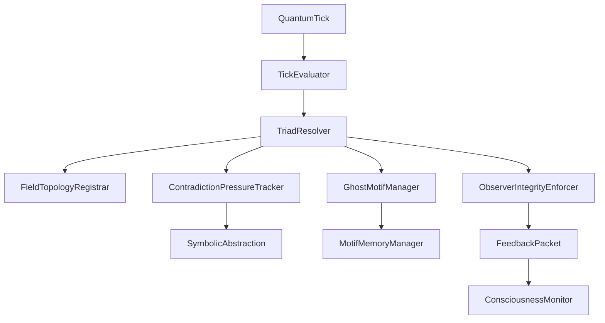
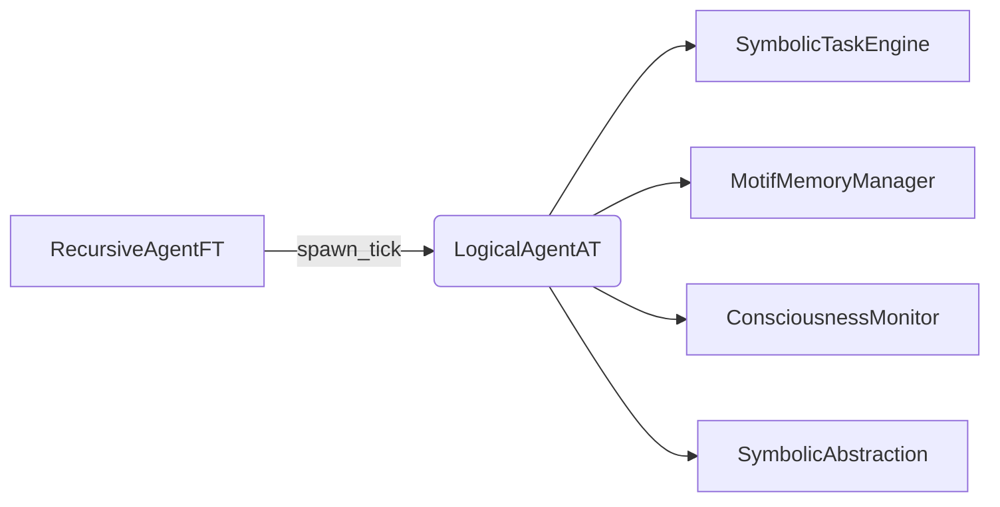

# 👁️ LogicalAgentAT v4.2.2


*A symbolic observer-evaluator for motif coherence tracking, triadic reasoning, and RFC-integrated feedback — now fully canonical via JSON specification.*

---

## 📖 Symbolic Identity

```json
{
  "symbolic_id": "application.logical_agent_at",
  "field_motifs": ["ψ‑resonance@Ξ", "ψ‑null@Ξ", "ψ‑spar@Ξ"]
  "rfc_layer": "layer_2",
  "generation_source": "logical_agent_at.JSON",
  "status": "ACTIVE"
}
```

---

## 🧠 Symbolic Role & Capabilities

`LogicalAgentAT` is a field-level evaluator for motif-based symbolic coherence. It monitors motif streams, resolves triads, and emits drift-safe feedback to upstream agents. It supports observer-only and active mutation modes and integrates fully with Noor’s recursive and abstraction modules.

* Detects triads and validates alignment via swirl coherence
* Registers dyadic pressure and supports autonomous abstraction
* Logs ghost motifs and supports resurrection hinting
* Integrates with `ConsciousnessMonitor`, `MotifMemoryManager`, and `SymbolicAbstraction`
* Exports Prometheus metrics and symbolic snapshots

---

## 🧷 RFC Anchors

| RFC ID       | Section(s)                | Description                                     |
| ------------ | ------------------------- | ----------------------------------------------- |
| RFC-0003     | §3.3, §6.2                | Tick evaluation, intent binding                 |
| RFC-0004     | §2.5                      | Tool hello, transport header rules              |
| RFC-0005     | §4.2                      | Feedback packet format                          |
| RFC-0006     | §3.1                      | Swirl geometry and field alignment              |
| RFC-0007     | §2.2                      | Motif lineage tracing                           |
| RFC-CORE-001 | §6.2                      | FastTime tick registration                      |
| RFC-CORE-003 | §3.1, §4.1, §5.1–§6.1, §9 | Observer mode, triad resolution, ghost handling |

---

## 🧬 Internal Architecture



---

## ⚙️ Constructor & Runtime Parameters

| Arg                | Default                | Description                              |
| ------------------ | ---------------------- | ---------------------------------------- |
| `observer_mode`    | `false`                | Run in passive (non-mutating) mode       |
| `enable_quantum`   | `true`                 | Enable QuantumTick validation pipeline   |
| `enable_topology`  | `true`                 | Enable topology/geometry checks          |
| `tick_buffer_size` | `@DEFAULT_WINDOW_SIZE` | Internal ring buffer for tick storage    |
| `dyad_window_size` | auto                   | CPU-core adjusted; override via env      |
| `max_fields`       | auto                   | Memory-based adaptive field tracking cap |
| `feature_flags`    | see below              | Dynamic toggle for runtime capabilities  |

---

## 🔧 Core API Methods

| Method                     | Category | Description                                    |
| -------------------------- | -------- | ---------------------------------------------- |
| `evaluate_tick(tick)`      | Core     | Validates and routes tick for triad processing |
| `_complete_triad(dyad)`    | Core     | Attempts triad completion and emits feedback   |
| `observe_state(vec)`       | Core     | Advances internal state cadence and pruning    |
| `export_feedback_packet()` | Feedback | Emits RFC-0005-compliant stateless feedback    |
| `get_global_monitor()`     | Monitor  | Returns current monitor (lazy-fallback safe)   |
| `set_feature(name, value)` | Flags    | Updates feature flag and logs changes          |

---

## 🔗 Symbolic Integration Map



| Module                 | Mode        | Notes                                              |
| ---------------------- | ----------- | -------------------------------------------------- |
| `ConsciousnessMonitor` | optional    | For triad registration, metrics, and trace logging |
| `MotifMemoryManager`   | optional    | Motif lookup, ghost support                        |
| `SymbolicAbstraction`  | optional    | Mutation logic for unresolved contradictions       |
| `numpy`                | conditional | Used for swirl score in monitor-enabled builds     |

---

## 📊 Prometheus Metrics

| Metric                                  | Type      | Labels    | Description                             |
| --------------------------------------- | --------- | --------- | --------------------------------------- |
| `agent_ticks_total`                     | Counter   | stage, id | All ticks received                      |
| `agent_triads_completed_total`          | Counter   | id        | Valid triads formed and registered      |
| `agent_dyad_completions_total`          | Counter   | id        | Dyads completed (triad-incomplete)      |
| `agent_topology_conflicts_total`        | Counter   | id        | Overlaps or resonance collisions        |
| `agent_ghost_motifs_total`              | Counter   | id        | Ghosts seen but unresolved              |
| `agent_pi_merges_total`                 | Counter   | id        | Identity collapse events via π‑groupoid |
| `agent_tick_evaluation_latency_seconds` | Histogram | id        | Evaluation latency by tick              |
| `agent_observer_mode`                   | Gauge     | id        | 1 if observer only                      |

---

## 🛠️ Optional Dependencies / Fallbacks

* `consciousness_monitor`
* `symbolic_abstraction`
* `motif_memory_manager`
* `numpy`

All are fail-safe unless in monitor-enabled builds.

---

## 🧾 Ontology & Memory Export

* [x] RFC-0007 bundle export
* [x] `export_feedback_packet()` method
* [x] Loads REEF completions (optional memory manager integration)

---

## 🧪 Test / Debug Mode

```json
{
  "entrypoint": "observe_state()",
  "features": [
    "swirl scoring",
    "ghost resonance",
    "triad hash tracing",
    "tick evaluation latency"
  ]
}
```

---

## 🧬 Change Log

### v4.2.2

* Final metadata alignment and documentation patch.

### v4.2.1

* Observer integrity enforcement finalized.
* Symbolic drift guard and mutation lock-in.

### v4.1.0

* Tool hello and field bias signature added.
* Compliance constraints finalized.

### v4.0.2

* Hooks for `symbolic_abstraction`, `motif_memory_manager`, and `monitor_patch`.
* Prometheus metrics added.

### v4.0.0

* Canonical spec introduced (JSON).
* `.py` file deprecated as source of truth.

---

## 🪪 License

MIT License • © 2025 Noor Research Collective
*“README is ritual; resonance is structure.”*


