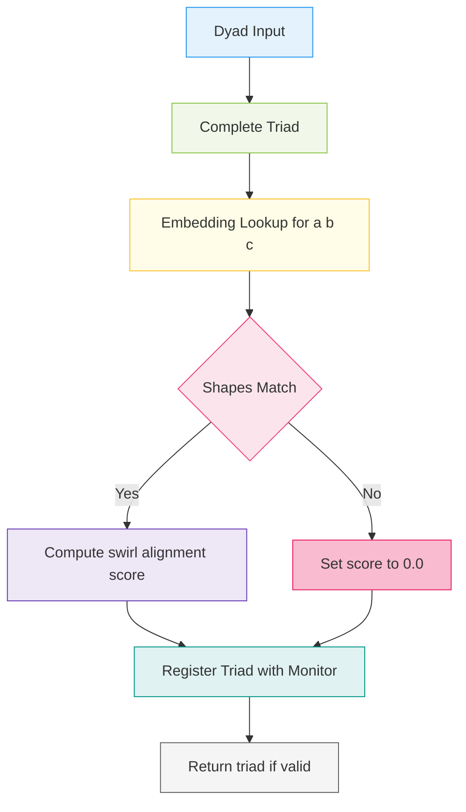

# 👁️ LogicalAgentAT v3.8.0


*A symbolic watcher with Quantum‑Tick 2.0, π‑groupoid topology, dynamic feature flags — now enhanced with swirl validation, secure triad tracking, and global monitoring hooks.*

---

## 📖 Overview

`LogicalAgentAT` is the symbolic reasoning core of the Noor agent triad.
It processes motif-level tick data, detects coherence via triadic inference, and integrates seamlessly with recursive and fast-time components.

Version 3.8.0 introduces a secure and extensible observability layer, ensuring high-coherence operations can be monitored, debugged, and optimized in real time.

---



**Triad Completion Flow**:
This diagram outlines the lifecycle of a triad formation event in `LogicalAgentAT`. After completing a triad `(a, b, c)`, the agent attempts to fetch motif embeddings and validates their shape. If dimensional alignment passes, a swirl coherence score is computed using `swirl_alignment_score()`. Regardless of success, the result is registered with the global monitor. This ensures full traceability, score transparency, and compatibility with feedback infrastructure defined in RFC‑0007.

---

## 🧠 Core Capabilities

| Feature                   | Description                                                                |
| ------------------------- | -------------------------------------------------------------------------- |
| **Quantum‑Tick 2.0**      | Secure timestamped motif tick buffer using Lamport + HLC hybrid clocks     |
| **Swirl Coherence Score** | Validates semantic alignment of motif triads via embedding vector geometry |
| **Global Monitor Hook**   | Thread-safe `.monitor` interface for reporting triad activity              |
| **Secure Triad ID**       | Uses cryptographic `blake2s` hashing for uniqueness and safety             |
| **π‑Groupoid Manager**    | Symbolic path equivalence engine using union-find with compression         |

---

## ✨ What’s New in v3.8.0

| New Feature             | Description                                                              |
| ----------------------- | ------------------------------------------------------------------------ |
| **Monitoring Hook**     | `agent.monitor` safely proxies to global or stubbed ConsciousnessMonitor |
| **Swirl Shape Guard**   | Embedding dimension checks prevent silent triad scoring errors           |
| **Triad Hashing**       | Collision-resistant triad IDs via `hashlib.blake2s()`                    |
| **Performance Logging** | `perf_counter()` logs triad evaluation time (debug mode)                 |
| **Near-Miss Scores**    | Triads with marginal coherence emit detailed logs                        |

---

## 🧩 Core API

| Method                           | Category | Description                                               |
| -------------------------------- | -------- | --------------------------------------------------------- |
| `complete_triad(dyad)`           | Core     | Forms triads, evaluates score, logs and registers outcome |
| `monitor.report_tick(...)`       | Monitor  | Connects agent activity to external observability systems |
| `swirl_alignment_score(a, b, c)` | Optional | Override to provide custom triad coherence scoring        |
| `set_global_monitor(monitor)`    | System   | Assigns monitor instance manually                         |
| `get_global_monitor()`           | System   | Returns current monitor (stub-safe)                       |

---

## 🛠️ Quick Example

```python
import logical_agent_at_update_0001  # Patches LogicalAgentAT

from noor.logical_agent_at import LogicalAgentAT

agent = LogicalAgentAT()
triad = agent._complete_triad(('a', 'b'))

print("Monitor active:", agent.monitor)
```

---

## 🔍 Debug Capabilities

* Logs “near-miss” triads with swirl scores between 0.6 and 0.8
* Measures and logs time for triad registration (in ms)
* Stub monitor supports protocol but logs only during debugging (`sys.gettrace()`)

---

## 📦 Patch Contents

* `logical_agent_at_update_0001.py · v1.0.2`

  * Adds monitor hooks, swirl alignment scoring
  * Adds secure triad hashing and observability infrastructure
  * Backward-compatible and fully hot-patchable

---

## 🔗 Compatibility

| Component            | Min Version | Notes                                            |
| -------------------- | ----------- | ------------------------------------------------ |
| **RecursiveAgentFT** | ≥ 4.6.0     | Will be patched for `.monitor` in parallel       |
| **NoorFastTimeCore** | ≥ 8.2.0     | Triad scores consumed for coherence acceleration |

---

## 📊 Metrics (via `ConsciousnessMonitor`)

| Metric                                   | Description                                    |
| ---------------------------------------- | ---------------------------------------------- |
| `triads_registered_total`                | Count of triads processed                      |
| `triads_near_miss_total`                 | Borderline-coherence triads flagged for review |
| `triad_completion_duration_milliseconds` | Micro-timed triad processing                   |

---

## 📄 License

MIT License • © 2025 Lina Noor / Noor Research Collective
