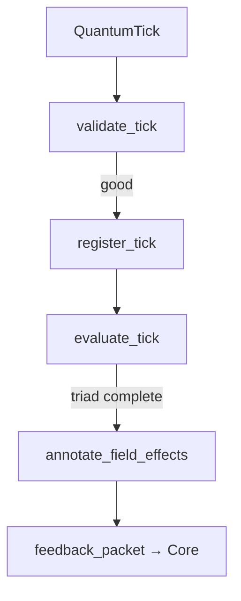

# 👁️ LogicalAgentAT v3.7.2 — *Watcher of Motif Topology*


> **Symbolic observer for QuantumTicks with π-groupoid topology, motif resonance detection, dynamic flags, and resurrection feedback.**

---

## 📘 Overview

`LogicalAgentAT` is the **Watcher** of Noor’s symbolic triad. It receives and evaluates QuantumTicks emitted by reasoning agents like `RecursiveAgentFT`, maintaining symbolic state, ring buffers, and dynamic feature gates.

It is **not** a transformer model — it operates in real time on structured, symbolic motifs and annotations.

Compliant with:

* RFC‑0003 §3–4 — Tick validation & annotations
* RFC‑0004 — Observer handshake (`tool_hello()`)
* RFC‑0005 §2–4 — Feedback bundles, context ratios, contradiction tracking

---

## 🌐 Core Functions

| Feature                      | Purpose                                                              |
| ---------------------------- | -------------------------------------------------------------------- |
| **QuantumTick v2**           | High-resolution tick registration with Lamport/HLC + HMAC validation |
| **MotifChange detection**    | Emits `MotifChangeID` when motif coherence shifts                    |
| **π‑Groupoid topology**      | Merges paths using regex-safe symbolic identifiers                   |
| **Dyad/Triad detection**     | Tracks symbolic completions and motif entanglement                   |
| **Ghost tracking & pruning** | Observes non-coherent motif traces for feedback or promotion         |
| **Cluster & Sheaf logic**    | Enables mutation, Laplacian smoothing, and stratum analysis          |

---

## 🔧 Constructor

```python
LogicalAgentAT(
    agent_id="watcher@default",
    observer_mode=False,
    feature_flags=None,
    enable_quantum_ticks=True,
    enable_memory_coupling=True,
    tick_buffer_size=256,
    pi_max_classes=20_000,
    hmac_secret=None,
    async_mode=False,
    verbose=False,
    enable_topology=False,
    enable_cluster_algebra=False,
    enable_sheaf_transport=False,
    enable_laplacian=False,
    enable_pi_groupoid=False,
    enable_ghost_tracking=True,
)
```

---

## 📊 Metrics (Prometheus)

| Metric Name                              | Labels              | Purpose                                |
| ---------------------------------------- | ------------------- | -------------------------------------- |
| `logical_agent_ticks_total`              | `stage`, `agent_id` | Count of ticks registered              |
| `logical_agent_tick_hmac_failures_total` | `agent_id`          | Failed HMAC verifications              |
| `logical_agent_feature_toggles_total`    | `flag`, `agent_id`  | Runtime flag flip tracking             |
| `logical_agent_dyad_completions_total`   | `agent_id`          | Completed triads via dyad detection    |
| `logical_agent_observe_latency_seconds`  | `agent_id`          | Feedback-loop latency (observe\_state) |

---

## 🧠 Internal Highlights

* **Dynamic Dyad Window**: Adapts based on available memory or CPU cores.
* **Triadic Completion Detection**: Finds third motif based on recent context or memory recall.
* **Motif Embedding Tracker**: Stores and compares field vectors for decay and pruning.
* **Contradiction Drift Journals**: Tracks symbolic inconsistency, supports resurrection hints.
* **Entanglement Field Registration**: Manages logical fields from triads, ghosts, or motif decay.

---

## 📈 Flow Diagram



---

## 🔗 Compatibility

| Component          | Required Version | Interaction                                      |
| ------------------ | ---------------- | ------------------------------------------------ |
| `RecursiveAgentFT` | ≥ v4.5.0         | Emits QuantumTicks consumed by LogicalAgentAT    |
| `NoorFastTimeCore` | ≥ v8.4.0         | Receives FeedbackPacket via `observe_feedback()` |

---

## 🪬 License

MIT License • © 2025 Lina Noor / Noor Research Collective

> *“The watcher does not remember. It re-members.”*
