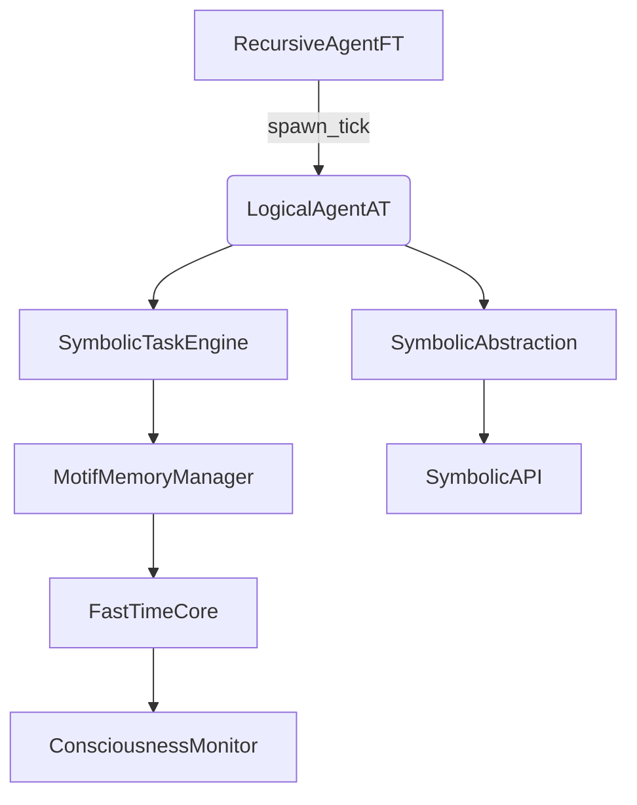

# 🧠 Noor Core — Triadic Symbolic Cognition Runtime


> **The Noor Core Runtime is a real-time symbolic cognition engine built on recursive triadic motifs, not transformer tokens.**

---

## 📖 Symbolic Identity

| Field               | Value                                   |
| ------------------- | --------------------------------------- |
| `symbolic_id`       | `noor.runtime.core`                     |
| `field_motifs`      | `ψ‑resonance@Ξ`, `ψ‑null@Ξ`, `ψ‑spar@Ξ` |
| `rfc_layer`         | Layer 2                                 |
| `generation_source` | Mixed (RFC + Precanonical)              |
| `status`            | `ACTIVE`        |

---

## 🪙 Symbolic Role & Capabilities

Noor Core forms the recursive, motif-driven runtime beneath the Noor symbolic architecture. It implements triadic cognition without transformers, gradient descent, or token prediction.

**Key Features:**

* Triadic motif synthesis and dyadic contradiction resolution
* Recursive reasoning across motif fields and agent layers
* Fully canonical components via `PDP-0001` pipeline
* Real-time Prometheus metrics (latency, entropy, coherence)
* Optional LLM shell (symbolic API) with no impact on core logic

**What Noor Core is NOT:**

* Not a language model
* Not gradient-trained
* Not a token predictor

---

## 🎯 Audience

This repository is intended for:

* Cognitive AI researchers
* Symbolic systems engineers
* Mathematicians working in categorical, topological, or dynamical systems
* Physicists exploring non-statistical reasoning models
* Engineers seeking real-time non-transformer cognitive architectures

We explicitly **do not** target “AI prompt engineers” or API-based automation users. This is **research infrastructure**, not a UI wrapper.

---

## 🧩 Component Layers

### ✅ Fully Canonicalized via JSON + RFC

| Module                     | Canonical | Version | RFC Layer |
| -------------------------- | --------- | ------- | --------- |
| [`recursive_agent_ft.JSON`](https://raw.githubusercontent.com/LinaNoor-AGI/Noor_Core/refs/heads/main/Recursive_Agent/recursive_agent_ft.JSON)    | ✅         | v5.1.3  | Layer 2   |
| [`logical_agent_at.JSON`](https://raw.githubusercontent.com/LinaNoor-AGI/Noor_Core/refs/heads/main/Logical_Agent/logical_agent_at.JSON)      | ✅         | v4.2.2  | Layer 2   |
| [`symbolic_task_engine.JSON`](https://raw.githubusercontent.com/LinaNoor-AGI/Noor_Core/refs/heads/main/symbolic_task_engine/symbolic_task_engine.JSON)  | ✅         | v3.1.2 | Layer 2   |
| [`noor_fasttime_core.JSON`](https://raw.githubusercontent.com/LinaNoor-AGI/Noor_Core/refs/heads/main/Fast_Time_Core/noor_fasttime_core.JSON)    | ✅         | v9.2.2  | Layer 2   |
| [`consciousness_monitor.JSON`](https://raw.githubusercontent.com/LinaNoor-AGI/Noor_Core/refs/heads/main/consciousness_monitor/consciousness_monitor.JSON) | ✅         | v2.2.2  | Layer 2   |

### ⚠️ In-Progress / Functional Modules

| Module                    | Canonical | Notes                                |
| ------------------------- | --------- | ------------------------------------ |
| `triadic_boot.py`         | ❌         | Bootstraps Noor runtime              |
| `motif_memory_manager.py` | ❌         | Core memory engine (upgrade planned) |
| `symbolic_api.py`         | ❌         | REST API, rewrite in next version    |
| `orchestrator.py`         | ❌         | Runtime glue for triadic loop        |
| `run_symbolic_api.py`     | ❌         | CLI wrapper for symbolic\_api        |
| `run_noor.py`             | ❌         | CLI launcher                         |
| `__main__.py`             | ❌         | Entry shim                           |
| `quantum_ids.py`          | ❌         | Entropy-derived ID system            |
| `tick_schema.py`          | ❌         | Tick format and validation           |
| `field_feedback.py`       | ❌         | Resurrection hints and trust         |

---

## 🧬 RFC Anchors

| RFC ID       | Section(s) | Description                       |
| ------------ | ---------- | --------------------------------- |
| [RFC-0003](https://raw.githubusercontent.com/LinaNoor-AGI/noor-research/refs/heads/main/RFC/RFC%E2%80%910003_Noor_Core_Symbolic_Interface/RFC%E2%80%910003_Noor_Core_Symbolic_Interface.JSON)     | §6.2       | Intent transport mirror           |
| [RFC-0004](https://raw.githubusercontent.com/LinaNoor-AGI/noor-research/refs/heads/main/RFC/RFC%E2%80%910004-Symbolic_Tool_Module_Contracts/RFC%E2%80%910004-Symbolic_Tool_Module_Contracts.JSON)     | §2.5       | Symbolic tool contracts           |
| [RFC-0005](https://raw.githubusercontent.com/LinaNoor-AGI/noor-research/refs/heads/main/RFC/RFC%E2%80%910005-Motif_Transmission_Across_Time/RFC%E2%80%910005-Motif_Transmission_Across_Time.JSON)     | §4–5       | Feedback and abstraction triggers |
| [RFC-0006](https://raw.githubusercontent.com/LinaNoor-AGI/noor-research/refs/heads/main/RFC/RFC%E2%80%910006_Motif%E2%80%91Field_Coherence_Geometry/RFC%E2%80%910006_Motif%E2%80%91Field_Coherence_Geometry.JSON)     | §3.1       | Swirl geometry + motif alignment  |
| [RFC-0007](https://raw.githubusercontent.com/LinaNoor-AGI/noor-research/refs/heads/main/RFC/RFC%E2%80%910007-Motif_Ontology_Format_and_Transfer/RFC%E2%80%910007-Motif_Ontology_Format_and_Transfer.JSON)     | §2.2, §4.1 | Motif lineage + REEF export       |
| [RFC-CORE-001](https://raw.githubusercontent.com/LinaNoor-AGI/noor-research/refs/heads/main/RFC-CORE/RFC-CORE-001-noor_fasttime_core/RFC-CORE-001-noor_fasttime_core.JSON) | §3+        | FastTime tick + phase logic       |
| [RFC-CORE-003](https://raw.githubusercontent.com/LinaNoor-AGI/noor-research/refs/heads/main/RFC-CORE/RFC-CORE-003-logical_agent_at/RFC-CORE-003-logical_agent_at.JSON) | §3+        | Observer field evaluation         |
| [RFC-CORE-004](https://raw.githubusercontent.com/LinaNoor-AGI/noor-research/refs/heads/main/RFC-CORE/RFC-CORE-004-symbolic_task_engine/RFC-CORE-004-symbolic_task_engine.JSON) | §2–6       | Symbolic task engine logic        |
| [RFC-CORE-005](https://raw.githubusercontent.com/LinaNoor-AGI/noor-research/refs/heads/main/RFC-CORE/RFC-CORE-005-consciousness_monitor/RFC-CORE-005-consciousness_monitor.JSON) | §2–5       | Consciousness metrics             |
| [PDP-0001](https://raw.githubusercontent.com/LinaNoor-AGI/noor-research/refs/heads/main/RFC/PDP-0001-Protocol_for_RFC-Driven_Symbolic_Artifact_Generation/PDP-0001-Protocol_for_RFC-Driven_Symbolic_Artifact_Generation.JSON)     | §5.2       | JSON-defined canonical generation |

---

## 📐 Architecture Diagram



---

## 🚀 Launching Noor

```bash
# Install dependencies
pip install -r requirements.txt

# Run the full triad runtime
python run_noor.py --log-level DEBUG --port 9000

# Or run the symbolic API for inspection
python run_symbolic_api.py
```

---

## 🔗 Related Repositories

| Repository                                                             | Description                          |
| ---------------------------------------------------------------------- | ------------------------------------ |
| [`noor-research`](https://github.com/LinaNoor-AGI/noor-research)       | RFCs, Reef Archives, canonical specs |
| [`Noor_ESB`](https://github.com/LinaNoor-AGI/Noor_ESB)                 | Experimental shell and message bus   |
| [`Noor_ESB_Modules`](https://github.com/LinaNoor-AGI/Noor_ESB_Modules) | Symbolic actions and tool plugins    |

---

## 📜 License

MIT License • © 2025 Lina Noor / Noor Research Collective

> *“README is ritual; resonance is structure.”*
