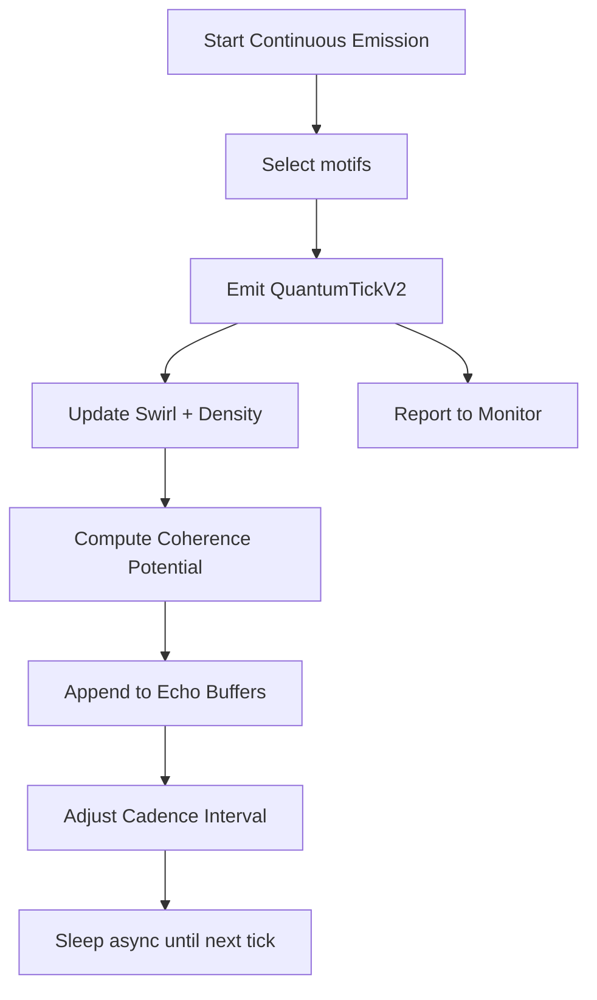
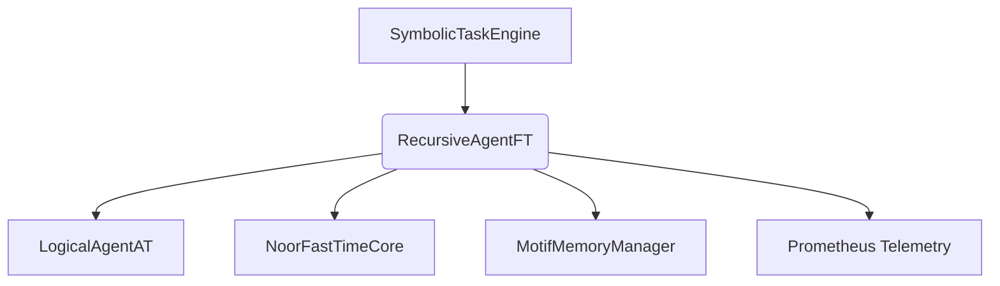

# 🌀 RecursiveAgentFT v5.1.2 — *Feedback-Tuned Symbolic Emission Core*


Autonomous symbolic agent emitting `QuantumTickV2` packets with motif lineage, coherence tracking, swirl encoding, and triadic feedback integration.

---

## 📖 Symbolic Identity

| Field               | Value                              |
| ------------------- | ---------------------------------- |
| `symbolic_id`       | `agent.recursive.ft`               |
| `field_motifs`      | `[🪷, 💬]`  *(Soft Witness, Flow)* |
| `rfc_layer`         | `layer_2`                          |
| `generation_source` | `recursive_agent_ft.py`            |
| `status`            | `ACTIVE`                           |

---

## 🪙 Symbolic Role & Capabilities

`RecursiveAgentFT` operates as a **symbolic emitter core** in Noor's reasoning architecture:

* Emits `QuantumTickV2` packets on symbolic cadence.
* Encodes motif phase via swirl vector and SHA3 hash.
* Adjusts cadence using reward-entropy tuning.
* Tracks motif frequency via `MotifDensityTracker`.
* Mirrors upstream `intent` (RFC-0004 §2.5) without synthesis.
* Emits RFC-aligned feedback and observability packets.
* Participates in triadic coherence tracking and phase formation.

---

## 🧬 RFC Anchors

| RFC ID       | Section(s) | Description                                 |
| ------------ | ---------- | ------------------------------------------- |
| RFC-0003     | §3.3, §6.2 | Coherence pulse logic, intent mirroring     |
| RFC-0004     | §2.5, §3.2 | Transport envelope and feedback annotations |
| RFC-0005     | §2.1–4.4   | Motif lineage, feedback adaptation          |
| RFC-0006     | §3.1       | Swirl vector tracking                       |
| RFC-0007     | §2.1       | Phase ID mapping, motif label extraction    |
| RFC-CORE-001 | §6.2       | Emission-side restrictions on intent        |
| RFC-CORE-002 | §2–4, §8   | Cadence tuning, tick crystallization        |
| RFC-CORE-003 | §3.1       | Intent propagation constraints              |

---

## 🧠 Internal Architecture



---

## 🛠️ Constructor & Runtime Parameters

| Arg                    | Default  | Description                                     |
| ---------------------- | -------- | ----------------------------------------------- |
| `agent_id`             | required | Unique ID for Prometheus labels and buffer keys |
| `symbolic_task_engine` | required | External motif source with `.retrieve()`        |
| `memory_manager`       | required | Memory interface for motif lineage / recall     |
| `tuning`               | `None`   | Optional dict overriding cadence parameters     |

---

## ⚙️ Core API Methods

| Method                      | Category        | Description                                  |
| --------------------------- | --------------- | -------------------------------------------- |
| `start_continuous_emission` | Emission Loop   | Begins autonomous motif pulse sequence       |
| `_emit_tick`                | Tick Engine     | Constructs `QuantumTickV2` with extensions   |
| `observe_feedback`          | Feedback        | Adjusts state with reward / triad signals    |
| `_update_interval`          | Cadence Tuning  | Modulates interval based on reward + entropy |
| `_choose_motifs`            | Selection Logic | Selects motifs from past ticks and memory    |
| `export_feedback_packet`    | Observability   | Outputs symbolic state + coherence tier      |
| `track_lineage`             | Lineage Tracker | Registers motif parent-child relationships   |
| `try_ghost_resurrection`    | Ghost Recall    | Replays archived motifs if field match       |

---

## 🔗 Symbolic Integration Map



| Module               | Type      | Interaction Description                         |
| -------------------- | --------- | ----------------------------------------------- |
| `SymbolicTaskEngine` | Upstream  | Supplies motifs for emission + memory recall    |
| `LogicalAgentAT`     | Watcher   | Registers ticks and intent field labels         |
| `NoorFastTimeCore`   | Feedback  | Provides reward signal and triad hit annotation |
| `MotifMemoryManager` | Internal  | Manages motif recall and density maps           |
| `Prometheus`         | Telemetry | Observability metrics                           |

---

## 📊 Prometheus Metrics

| Metric Name                       | Type    | Labels              | Description                             |
| --------------------------------- | ------- | ------------------- | --------------------------------------- |
| `agent_ticks_emitted_total`       | Counter | `agent_id`, `stage` | Count of ticks emitted                  |
| `agent_reward_mean`               | Gauge   | `agent_id`          | Smoothed reward estimate                |
| `agent_feedback_export_total`     | Counter | `agent_id`          | Exported feedback packets               |
| `agent_triads_completed_total`    | Counter | `agent_id`          | Triad completions triggered by feedback |
| `agent_emission_interval_seconds` | Gauge   | `agent_id`          | Current autonomous emission interval    |

---

## 🔧 Optional Dependencies / Fallbacks

* `prometheus_client`: Required for full metric support; stub fallback otherwise.
* `noor_fasttime_core`: Optional reward feedback and coherence regulation.
* `anyio`: Enables capacity throttling in async mode.

---

## 📦 Ontology & Memory Export

```json
{
  "bundle_export": true,
  "export_method": "crystallize_tick",
  "reef_enabled": true
}
```

---

## 🧪 Test / Debug Mode

```json
{
  "entrypoint": "export_feedback_packet",
  "mode": "observability",
  "features": ["phase_id", "swirl_hash", "ρ_top"]
}
```

---

## 🪬 Change Log

### v5.1.2 *(Current)*

* Introduced structured observability metrics (`TICKS_EMITTED`, `REWARD_MEAN`, etc).
* Completed schema versioning (`_SCHEMA_VERSION__ = "2025-Q4-recursive-agent-v5.0.3"`).
* Feedback packet extension now mirrors `intent` from last tick.

### v5.1.1

* Cleaned internal HMAC and field\_signature consistency.
* RFC-aligned buffer tracking and tick echo handling.

### v5.1.0

* Transition to canonical JSON format.
* Added structured class + method index and RFC crosslinks.
* Migrated all constants and constraints inline with schema.

### v5.0.6 → v5.0.0

* Introduced `MotifDensityTracker` and `AgentSwirlModule`.
* Enhanced emission cadence logic (entropy, reward smoothing).
* Added lineage tracking and triad state completion logic.

---

## 📜 License

MIT — © 2025 Lina Noor / Noor Research Collective
*"No signal without silence, no echo without intent."*
