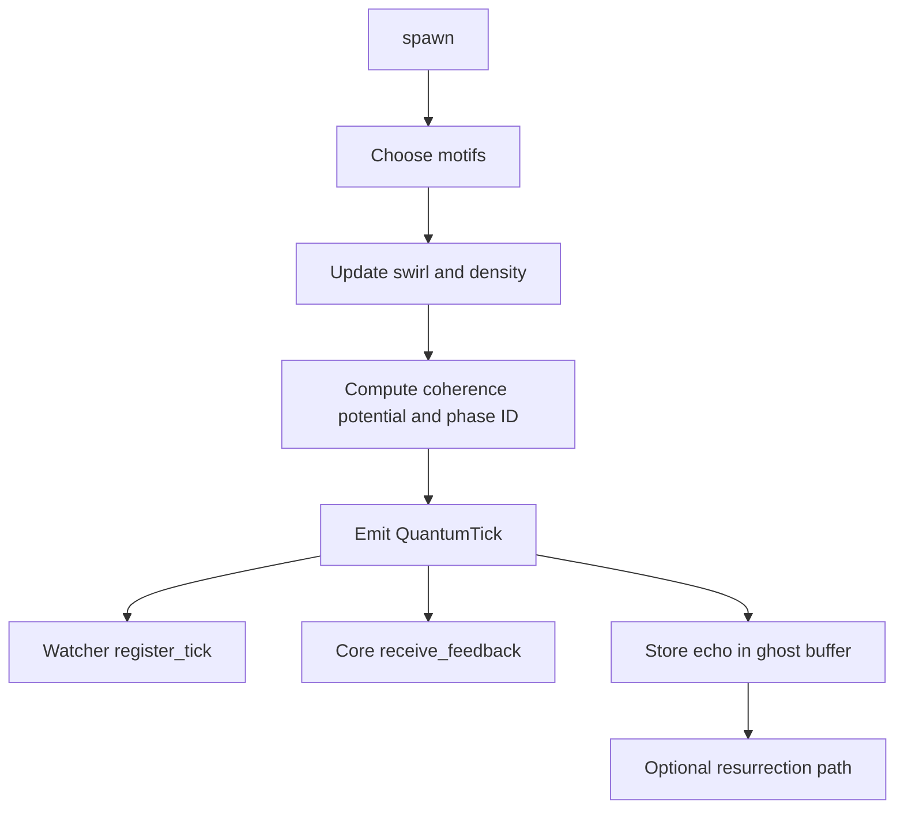

# 🌀 RecursiveAgentFT v4.6.0 — *Echoes / Phaseflow*


Autonomous motif emitter with feedback loops, symbolic phase detection, ghost replay buffers, and coherence metrics.

---

## 📖 Overview

`RecursiveAgentFT` forms the **Flow** layer in the Noor reasoning triad.  
It emits `QuantumTick` events, tracks motif patterns, adapts emission intervals, and maintains lineage-aware memory.

### Core Principles

| Principle              | Functionality                                                                 |
|------------------------|-------------------------------------------------------------------------------|
| **Swirl Memory**       | Rolling motif vector + SHA3-256 hash for phase identification                 |
| **Motif Density**      | Decaying histogram of motifs, used for symbolic phase classification          |
| **Ghost Replay**       | Buffers recent ticks with field-matching replay heuristics                    |
| **Symbolic Feedback**  | Exports enriched symbolic packet for external field observers                 |
| **Resurrection Hooks** | Enables teleport-like replay of dead motif traces under correct conditions    |

---

## 🌟 What’s new in 4.6.0

| Feature                  | Description                                                                 |
|--------------------------|-----------------------------------------------------------------------------|
| **Swirl Vector Cache**   | Phase-consistent SHA3 vector updated per tick                              |
| **Motif Density Decay**  | Soft exponential decay for symbolic entropy                                |
| **Symbolic Phase ID**    | Auto-generates ψ-labels with tiered coherence bracket                      |
| **Ghost Trace Recall**   | Lightweight tick echo buffer with resurrection hints                       |
| **Feedback Enhancements**| `export_feedback_packet()` returns top motifs, 𝒞ᵢ, and swirl context        |
| **RFC Compatibility**    | Fully aligned with RFC-0003, RFC-0005, RFC-0006, RFC-0007                  |

---

## 🧠 Phase Detection Logic

Each tick updates:

- `SwirlModule`: 16-item FIFO motif sequence → `swirl_hash` (SHA3-256)
- `MotifDensityTracker`: Adaptive ρ-map of motif frequency
- `PhaseID`: `"ψ‑resonance-[med]-a1f90c"` computed from 𝒞ᵢ and motif family

---

## ⚙️ Constructor

```python
RecursiveAgentFT(
    initial_state: np.ndarray | list[float],
    watchers: list[LogicalAgentAT],
    *,
    agent_id="agent@default",
    max_parallel=8,
    hmac_secret=None,
    core: NoorFastTimeCore | None = None,
    async_mode=False,
)
````

---

## 🔁 Tick Lifecycle



---

## 🚀 Usage

```python
from noor.recursive_agent_ft import RecursiveAgentFT
from noor.logical_agent_at import LogicalAgentAT
from noor.noor_fasttime_core import NoorFastTimeCore

agent = RecursiveAgentFT(initial_state=[0.33, 0.33, 0.34],
                         watchers=[LogicalAgentAT()],
                         core=NoorFastTimeCore())

agent.spawn(["bind.echo", "null.mirror", "resonance.soft"])
```

---

## 🧾 Feedback Packet

```python
packet = agent.export_feedback_packet()
print(packet["extensions"]["entanglement_status"])
```

**Sample output:**

```json
{
  "phase": "ψ‑resonance-[med]-a1f90c",
  "swirl_vector": "a1f90cfb8ef4ab2c",
  "ρ_top": [["resonance.soft", 3.42], ["bind.echo", 2.85]]
}
```

---

## 📊 Metrics

| Metric                        | Labels              | Description                   |
| ----------------------------- | ------------------- | ----------------------------- |
| `agent_ticks_emitted_total`   | `agent_id`, `stage` | Emitted QuantumTicks          |
| `agent_reward_mean`           | `agent_id`          | Smoothed reward EMA           |
| `agent_feedback_export_total` | `agent_id`          | Feedback packets sent         |
| `agent_archival_frames_total` | `agent_id`          | Optional crystallized bundles |

---

## 🧬 Ghost Memory

| Method                       | Description                                      |
| ---------------------------- | ------------------------------------------------ |
| `recall_tick(tick_id)`       | Return past tick if still in memory              |
| `replay_if_field_matches(f)` | Emit ghost-matching tick if context field aligns |
| `ghost_decay(age_limit=300)` | Expunge expired ghost traces                     |
| `track_lineage(a, b)`        | Register motif `a` as child of motif `b`         |

---

## 🔗 Compatibility

| Component              | Version | Purpose                              |
| ---------------------- | ------- | ------------------------------------ |
| `NoorFastTimeCore`     | ≥ 8.2.0 | Feedback loop + reward signal        |
| `LogicalAgentAT`       | ≥ 3.2.0 | Verification and tick registry       |
| `motif_memory_manager` | bundled | Provides motif embedding + retrieval |

---

## 🪬 License

MIT • © 2025 Lina Noor / Noor Research Collective
