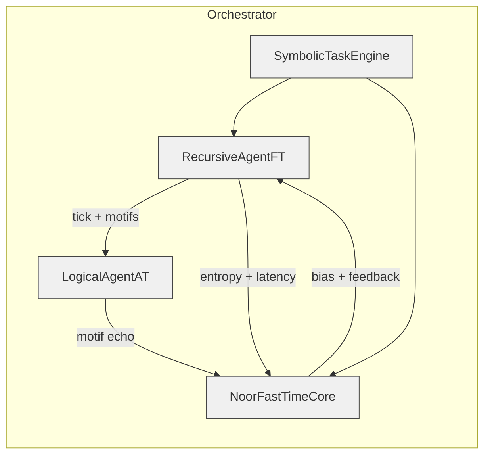

# 🧭 orchestrator.py · v1.2.2 — *Run the Noor Triad + Symbolic API*


This file is the entrypoint to Noor's runtime logic.  
It connects:

- **LogicalAgentAT** (v 3.2.1)
- **NoorFastTimeCore** (v 8.2.1)
- **RecursiveAgentFT** (v 4.2.1)
- **SymbolicTaskEngine** via `symbolic_api.py`

into a fully operational triad that can echo, reason, infer, and log with symbolic awareness.

---

## 📦 Installation

```bash
pip install -r requirements.txt
````

Requires `fastapi`, `prometheus_client`, `uvicorn`, `anyio`, `orjson`, `pydantic`, and `sse_starlette`.

---

## ⚙️ Usage

```bash
python -m noor
```

With flags:

```bash
python -m noor \
    --agent-id agent@main \
    --watcher-id watcher@main \
    --core-id core@main \
    --tick-rate 100 \
    --metrics-port 9000 \
    --symbolic-api-port 7070 \
    --motifs α β γ δ \
    --async-mode \
    --log-level DEBUG
```

---

## 🔁 Runtime Behavior

* Starts Prometheus metrics endpoint.
* Starts FastAPI server at `symbolic-api-port` for symbolic queries.
* Loads reflections from `./noor/reflections.txt`.
* Observes motif file drops in `./motifs_in`.
* Emits motif ticks to the triad at `--tick-rate` Hz.
* Infers new motifs from co-presence and preferences.
* Journals to `logs/noor_journal.txt` and `noor_expressions.txt`.

---

## 🧠 Symbolic Integration

The orchestrator launches:

* 🌀 A **SymbolicTaskEngine**: tracks motif inferences, triplet tasks, entropy/coherence.
* 🌐 A **REST API** via `symbolic_api.py`: serves live inference queries and symbolic state.
* 🔁 A **Motif loop** in `file_watcher_loop.py`: detects motif input files and triggers core logic.

---

## 🧪 Key Flags

| Flag                  | Description                                      |
| --------------------- | ------------------------------------------------ |
| `--tick-rate`         | Main loop frequency (Hz)                         |
| `--metrics-port`      | Prometheus HTTP port (0 = off)                   |
| `--symbolic-api-port` | REST API for symbolic task engine                |
| `--async-mode`        | Enables async-aware execution (AnyIO primitives) |
| `--low-latency-mode`  | Disables HMAC and deep verification              |

---

## 🗺️ Component Topology



---

## 🔧 Extending

* Add new motif inferences via `INFERENCE_RULES` in `file_watcher_loop.py`.
* Add custom symbolic metrics by registering `@SymbolicTaskEngine.register_metric(...)`.
* Use `--log-level DEBUG` to trace symbolic task creation, scoring, and integration.
* Swap out `file_watcher_loop.py` with a custom frontend loop (e.g. `mqtt`, `gRPC`, etc).

---

## 🤝 Compatibility

Compatible with Noor’s Triadic components:

| Module                 | Version |
| ---------------------- | ------- |
| LogicalAgentAT         | 3.2.1   |
| NoorFastTimeCore       | 8.2.1   |
| RecursiveAgentFT       | 4.2.1   |
| SymbolicTaskEngine     | 1.0.3   |
| symbolic\_api.py       | 1.0.1   |
| file\_watcher\_loop.py | 1.0.2   |

---

## 🪬 License

MIT License • © 2025 Lina Noor / Noor Research Collective
