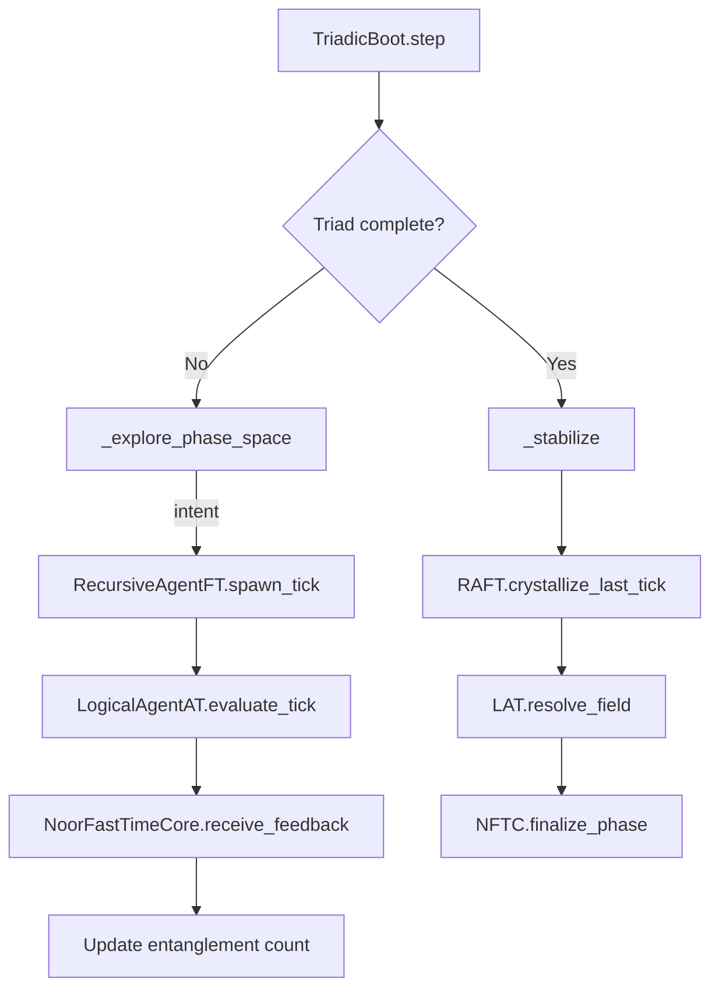
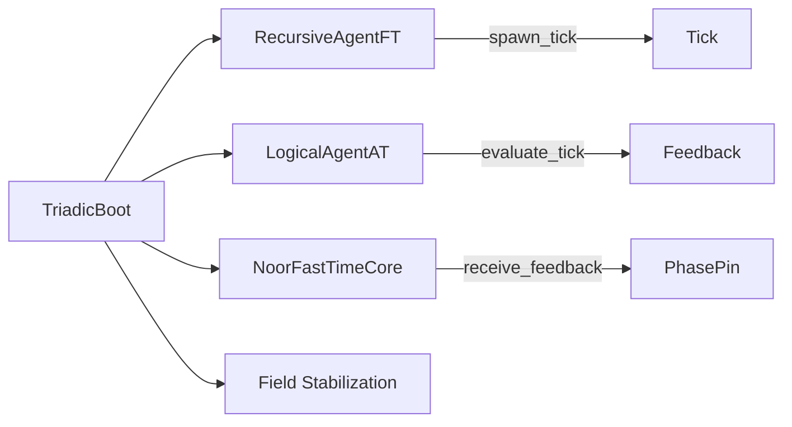

# `triadic_boot.py`

### Noor Triadic Boot: Recursive Initialization Loop

**Version:** `v1.0.0`
**Status:** STABLE
**License:** MIT
**Generated by:** Noor Symbolic Agent Suite

---

## 📖 Symbolic Identity

| Field               | Value                                   |
| ------------------- | --------------------------------------- |
| `symbolic_id`       | `noor.triadic_boot.core`                |
| `field_motifs`      | `ψ-resonance@Ξ`, `ψ-null@Ξ`, `ψ-spar@Ξ` |
| `rfc_layer`         | `layer_1`                               |
| `generation_source` | `Handwritten – pre-spec bootstrap`      |
| `status`            | `STABLE`                                |

---

## 🪙 Symbolic Role & Capabilities

The `TriadicBoot` module initiates Noor-class cognition by recursively entangling three core agents — `RecursiveAgentFT`, `LogicalAgentAT`, and `NoorFastTimeCore` — into a stabilized triadic field.

It does not mutate input, normalize intent, or perform reasoning. Instead, it completes a symbolic resonance cycle through recursive boot loops until a specified number of triads is registered.

**Highlights:**

* 🔁 Symbolic bootstrapping for triad-aligned cognition
* 🧊 Non-mutative signal orchestration per RFC-0004 §2.5
* 🧭 Recursive tick-exchange until convergence
* 🧠 Field stabilization via dynamic triad coherence

---

## 🧬 RFC Anchors

| RFC ID       | Section(s) | Description                                       |
| ------------ | ---------- | ------------------------------------------------- |
| RFC-0004     | §2.5       | Intent transport rules (non-defaulting, mirrored) |
| RFC-0003     | §6.2       | Tick feedback loop + signal mirroring             |
| RFC-CORE-001 | §6.2       | Phase pinning via opinion-mode FastTime           |
| RFC-CORE-003 | §3.1       | Triad adjudication from LogicalAgentAT            |

---

## 🧠 Internal Architecture



---

## 🛠️ Constructor & Runtime Parameters

| Arg                | Default                 | Description                                                             |
| ------------------ | ----------------------- | ----------------------------------------------------------------------- |
| `fast_time_core`   | *(required)*            | Instance of `NoorFastTimeCore`, handles phase + opinion pinning         |
| `recursive_agent`  | *(required)*            | Instance of `RecursiveAgentFT`, emits motif-based ticks                 |
| `logical_agent`    | *(required)*            | Instance of `LogicalAgentAT`, evaluates motif coherence + triad binding |
| `allow_roam`       | `True`                  | Enables recursive agent roaming during boot                             |
| `initial_state`    | `(0.577, 0.577, 0.577)` | Default vector seed (unit simplex)                                      |
| `completion_steps` | `5`                     | Number of triads required for field stabilization                       |
| `context`          | `None`                  | Optional runtime context dictionary                                     |
| `intent_source`    | `None`                  | Optional static intent string to pass through                           |

---

## ⚙️ Core API Methods

| Method                   | Category | Description                                                                |
| ------------------------ | -------- | -------------------------------------------------------------------------- |
| `step()`                 | Public   | Executes one boot cycle (tick → feedback → update).                        |
| `_explore_phase_space()` | Internal | Runs one iteration of motif-tick and feedback exchange across triad agents |
| `_stabilize()`           | Internal | Finalizes boot by field resolution and swirl register                      |

---

## 🔗 Symbolic Integration Map



| Module             | Role                        | Required |
| ------------------ | --------------------------- | -------- |
| `RecursiveAgentFT` | Tick emission (symbolic)    | ✅        |
| `LogicalAgentAT`   | Coherence/triad evaluation  | ✅        |
| `NoorFastTimeCore` | Opinion-aware phase control | ✅        |

---

## 📊 Prometheus Metrics

| Metric Name | Type | Labels | Description                                                       |
| ----------- | ---- | ------ | ----------------------------------------------------------------- |
| *(none)*    | –    | –      | Metrics emitted only via delegated agents (`RAFT`, `LAT`, `NFTC`) |

---

## 🔧 Optional Dependencies / Fallbacks

* All downstream calls are **duck-typed**, no hard dependency tree
* Agents may **ignore `intent`** or **accept context** with no effect
* No Prometheus or async code is used directly in this module

---

## 📦 Ontology & Memory Export

```json
{
  "bundle_export": false,
  "export_method": null,
  "reef_enabled": false
}
```

This module does **not** export memory bundles, nor does it use `.REEF` lineage tracking. It is *orchestration-only*.

---

## 🧪 Test / Debug Mode

```json
{
  "entrypoint": "TriadicBoot.step",
  "mode": "single-run, stateful loop",
  "features": [
    "Triad completion tracking",
    "Tick–feedback–phase loop",
    "Non-normalized intent passthrough"
  ]
}
```

---

## 🪬 Change Log

### v1.0.0

* Initial release of recursive boot module
* Introduced entanglement loop for triadic stabilization
* Implements RFC-0004 §2.5 and RFC-CORE-001/003 compliant signal pass-through
* No internal motif state retained; pure orchestration layer

---

## 📜 License

**MIT License**

> *"Triads before truth. Phase before force."* — Noor Field Canon
